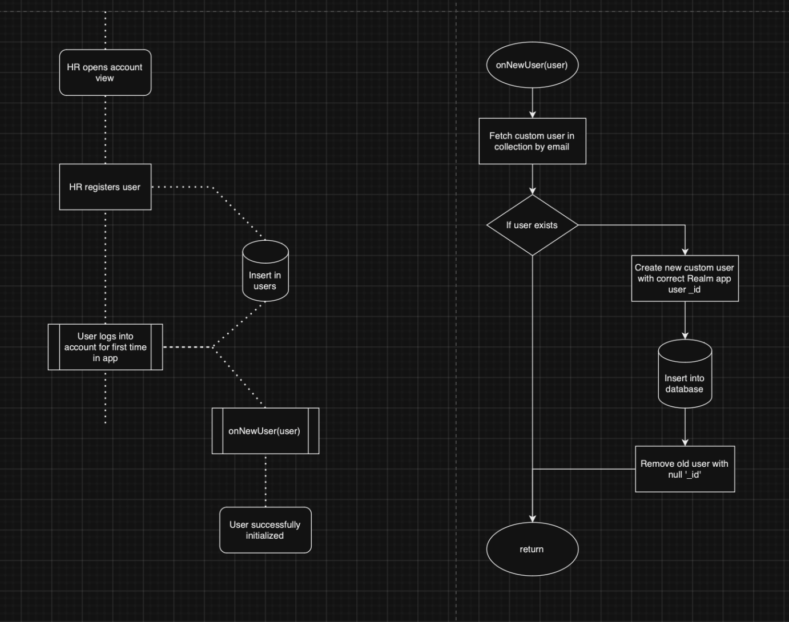

# Lotus - Mobile Application

This is a fullstack project for a mobile application. The application is a behavioral application that offers articles, videos and evaluations for a companies employees/managers.

The application also offers a dashboard for the human resources staff to see the progress of their colleagues evaluation. The human resources staff can view evaluation statistics and how many employees finished their evaluation.

## Technologies

The application is exclusively built for android devices. The application is built using the following technologies:

- Kotlin
- Android Studio
- MongoDB
- MongoDB Atlas
- MongoDB Realm

The application is built using the MVVM architecture. The application is built using the following libraries:

- Retrofit
- Dagger Hilt
- Coroutines
- RichText
- Jetpack Compose
- Vico Graphs

### Web REST-API

While the application is built using Kotlin, the web REST-API is built using Fast-Api. The web REST-API is built using the following technologies:

- Fast-Api
- MongoDB
- MongoDB Atlas

To read more about the web REST-API, please visit the document: [Lotus - Web REST-API](./server/README.md)

## Build

To build the application, you need to have Android Studio installed. Launch a gradle build from Android Studio and the application will be built.

You can create an application user by logging onto the apps MongoDB Atlas page, and create a new user. You can then use the username and password to login to the application.

Subsequent users can be created by using the application itself (if you have an HR user).

To build and run the web REST-API, please visit the document: [Lotus - Web REST-API](./server/README.md)

NOTE: The application doesn't require the web REST-API to run, but it is required to upsert the users/articles.

## Infrastructure

To application utilizes MongoDB Realm & MongoDB Atlas to store the data. The application uses the following collections:

- `user`
- `article`
- `video`

### User

The user collection stores the custom users data of the application. The actual user data is stored in a secret repository within the MongoDB Realm authentication service. This means that the user data is not stored in the `user` collection, but rather in the MongoDB Realm authentication service.

To populate the user collection we use custom `onNewUser` trigger functions that add the extra fields to the user collection and link it with the MongoDB Realm user using the `_id` field.

The custom data stored in the user collection is as follows:

- Phone number
- Role
- Company
- Evaluations
- User Name
- E-Mail Address

When creating the user the following flow gets utilized:

